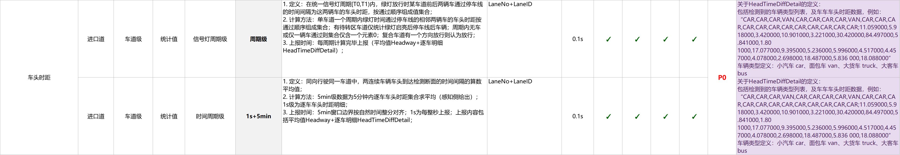

已有：

	项目介绍：通过DDS订阅的感知数据即每一帧的车辆轨迹 目标信息，每一帧包含当前时刻的所有车辆位置、速度、类型、车长等信息。

	原始的traffic_flow代码 原来的模式叫线圈检测器，是满足条件发送，然后又新增了闪照模式和累积模式。

需求：

	

下面是AI生成的项目介绍：

**基于DDS的交通流量统计服务（traffic_flow）**

该项目是一个交通流量统计微服务，通过DDS中间件订阅路侧感知设备发布的车辆轨迹数据（RSM JSON），对车道级车辆信息进行实时统计，输出流量、排队、车头时距等交通指标，服务于智慧交通场景。

**原有架构：** 采用单例工厂模式（TrafficFlowFactory）作为核心调度器，内部维护一个工作线程从阻塞队列消费感知数据，分发到三条并行检测器管道——旧线圈检测器管道（事件驱动，检测器自行决定输出时机）、快照检测器管道（1秒周期）、累积检测器管道（5分钟周期）。检测器类型和输出周期通过JSON配置文件驱动，新增检测器只需实现基类接口并在配置中注册即可。

**我的改动：** 负责将旧线圈体系中的车头时距（Headway）检测器迁移到新的快照/累积双管道架构中。原有HeadwayDetector自己维护轨迹、自行计算线段相交检测过线，代码复杂且未接入新管道，也不满足"1秒输出逐车明细、5分钟输出平均值"的需求规范。我将其拆分为SnapshotHeadwayDetector（1秒周期，输出逐车头时距明细HeadTimeDiffDetail）和AccumulateHeadwayDetector（5分钟周期，输出算术平均值），复用项目统一的StopLineCrossingTracker进行过线检测，通过C++多态机制接入工厂的配置驱动创建流程，并编写了独立自测程序验证功能正确性。
