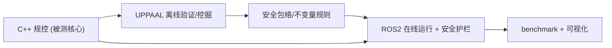

# 项目想法整理（备忘 · CommonUppRoad 升级版）

## 一句话定位

> **《基于形式化验证 + 自适应对抗搜索的自动驾驶安全测试框架》**——上层算法撑毕业论文，下层 C++/ROS 系统撑开发面试。

## 核心思想：一个项目，两副面孔

- **论文面**：创新方法（自适应对抗场景挖掘）+ 真实规控被测栈 + 量化实验（baseline/指标/加速比）
- **开发面**：C++ 规控 + 并行验证引擎 + ROS2 在线系统 + 安全护栏 → 可复现、能讲 30 分钟
- **主线交点**：造这个项目的过程，顺便把你求职主线的 **C++系统 + 规控(MPC/LQR) + ROS2** 全练了

## 三层角色与数据流（关键，别混）

| 角色     | 技术                                       | 职责                                                      | 在线/离线      |
| -------- | ------------------------------------------ | --------------------------------------------------------- | -------------- |
| 被测核心 | **C++ 规控**（LQR/MPC + A*/Lattice） | 替换 IDM，是"会开车的车"，贯穿两端                        | 两端           |
| 形式验证 | **UPPAAL + verifyta 并行引擎**       | 建模、验安全、挖长尾必撞场景、**产出安全包络/规则** | **离线** |
| 在线运行 | **ROS2 中间件**                      | 实时跑规控栈+仿真，部署②产出的安全护栏                   | **在线** |

> 一句话：**UPPAAL 离线"验+挖规则"，ROS2 在线"跑规控+执行护栏"，C++ 规控是被验证也被运行的那个核心。**

## 三个升级落点

| 落点 | 内容                                                         | 优先级          |
| ---- | ------------------------------------------------------------ | --------------- |
| ①   | C++ 规控模块替换 IDM（最对口、顺便练主线）                   | ⭐⭐⭐ 必做     |
| ②   | 整条链跑进 ROS2（ros2_control + C++ 节点 + Gazebo/Autoware） | ⭐⭐ 选做       |
| ③   | 离线挖掘 → 在线 ROS2 安全护栏(RV/Safety Shield)             | ⭐⭐ 差异化王牌 |

> 组合建议：**①必做；②③挑一个做加分**（要"系统集成"选②，要"亮点故事"选③）。别贪全做。

## 论文要交 vs 开发要交

- **论文**：☑方法有新意 ☑有baseline对比 ☑有量化指标 ☑验证真实规控
- **开发**：☑C++核心 ☑并行加速出数字 ☑自动化闭环 ☑ROS2/工业标准 ☑能深讲

## 简历句（占位，数字待补）

> 基于 CommonRoad + ROS2 的自动驾驶安全测试框架：实现 C++ 规划(Lattice)+控制(MPC/LQR) 作为被测栈，用 UPPAAL 形式化验证 + 并行 verifyta 引擎离线挖掘长尾必撞场景，并将安全包络部署为 ROS2 在线运行时验证安全护栏节点，实时拦截不安全轨迹。

## 留给你后续思考的开放问题

1. ②和③**先做哪个**？（看你更想要"ROS系统集成"还是"在线安全"这个亮点）
2. 规控模块做**多深**够论文/面试用？（横向LQR是否够，还是必须上MPC）
3. 现有 Python 代码哪些保留做"编排层"、哪些用 C++ 重写做"性能核心层"？
4. 时间不够时，**最小可交付版本**是①+并行verifyta，其余作为"架构演进方向"讲给面试官——可接受吗？

---

先存着，想到哪块我们再往下拆。需要我把这份整理导出成一个 md 文件结构，随时说。
